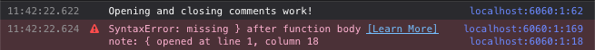

# demo-react-styleguidist-js-inline-comment
Reproducible demo for a bug

### Setup
```
git clone https://github.com/jaller94/demo-react-styleguidist-js-inline-comment.git
npm install
```

### Run
Either run the dev server `npm run-script server` or build it `npm run-script build`.

### Observing the issue
Open the styleguide in the browser (default for server: http://localhost:6060/).
When you open the JavaScript console, you should see this.



These errors come from the second `<script>` tag in `react-styleguide.html`, which is valid JavaScript in HTML.
